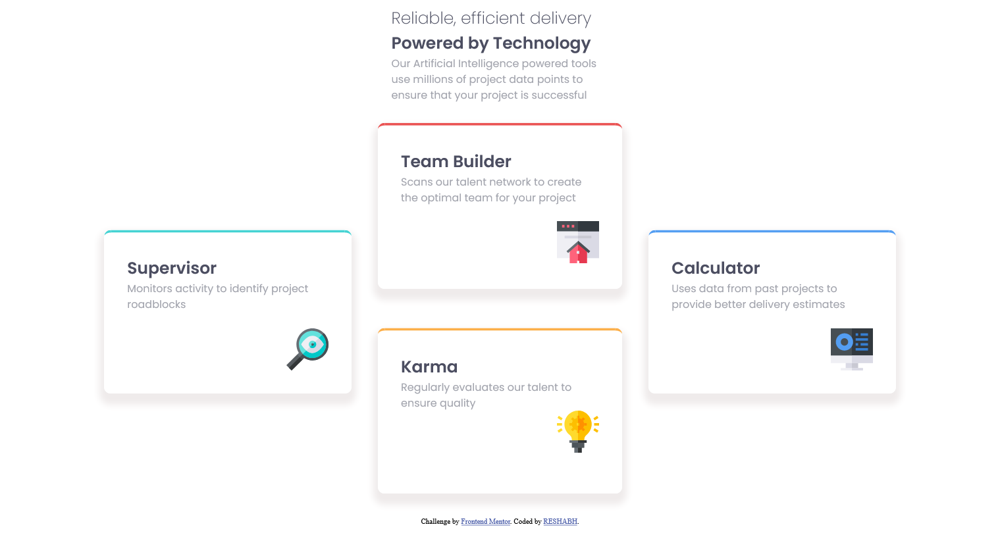

# Four card feature section solution

This is a solution to the [Four card feature section challenge on Frontend Mentor]

## Overview

### The challenge

Users should be able to:

- View the optimal layout for the site depending on their device's screen size

### Screenshot

### Built with

- Semantic HTML5 markup
- CSS custom properties
- Flexbox

